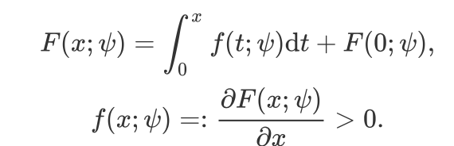

# Shape Constraints on Nerual Networks

This repo containts the shape constraints methods based on *ordinary differential equation*, which is first proposed in [UMNN (Unconstrainted Monontonic Neural Network)](https://arxiv.org/abs/1908.05164). In UMNN, the authors conduct monotonic constraint on neural network by parameterzing the function as

Here, we extend this framework into another shape constraints beyond monotone, i.e., **increasing concave** and **general concave** functions.

**increasing concave**:

**general concave**:

For more details, please refers to [this slides](https://j-zin.github.io/files/shape_constraint_NN_slides.pdf). We demonstrate a toy experiment here of the regression task to show its effectiveness on shape constraints. The experimental setting follows that in UMNN and the code logit is based on [this repo](https://github.com/AWehenkel/UMNN).

|   |       |           |
| -------------------------------------------- | --------------------------------------------------- | --------------------------------------------------- |
|  |  |  |

